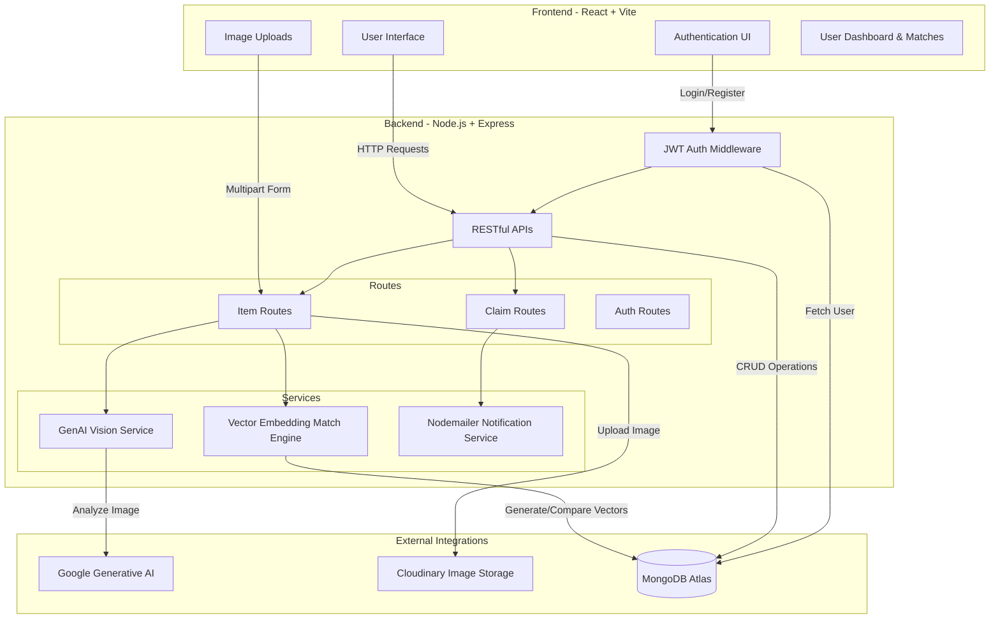

# 🔍 KhojAI

[](https://khoj-ai-rho.vercel.app/)

KhojAI is an AI-driven, full-stack lost-and-found platform that revolutionizes the way people report and recover lost items. Built on the MERN stack, it leverages Generative AI and vector embeddings to intelligently match lost items with found items, significantly reducing manual search efforts.

---

## 🚀 Live Demo
**Check out the live application here:** [KhojAI Live Demo](https://khoj-ai-rho.vercel.app/)

---

## 🌟 Key Features
- **AI-Powered Image Analysis**: Automatically extracts item details, colors, and features from uploaded images using Google Generative AI vision models.
- **Intelligent Semantic Matching**: Uses vector embeddings to calculate similarity scores between lost and found items, triggering instant matches.
- **Automated Notifications**: Real-time automated email alerts and in-app notifications for high-probability item matches and user claims.
- **Secure Image Hosting**: Optimized image storage and delivery handled through Cloudinary integration.
- **Role-Based Access Control**: Secure JWT-based authentication safeguarding user claims and item workflows.
- **Responsive Modern UI**: Built with React, Tailwind CSS, and Framer Motion for a seamless experience across all devices.

---

## 🏗️ Architecture Diagram

Below is the high-level architecture diagram of KhojAI:



---

## 💻 Tech Stack

### Frontend
- **React 19** (Vite)
- **Tailwind CSS 4** (Styling)
- **Framer Motion** (Animations)
- **React Router v7** (Routing)
- **Lucide React** (Icons)

### Backend
- **Node.js & Express.js** (API Server)
- **MongoDB & Mongoose** (Database & ODM)
- **Google Generative AI** (Vision & Analysis)
- **Cloudinary** (Image Hosting via Multer)
- **JSON Web Token (JWT)** (Authentication)
- **Nodemailer** (Email Services)

---

## 🛠️ Installation & Setup

To run this project locally, follow these steps:

### Prerequisites
- Node.js installed on your machine
- A MongoDB Atlas account/cluster
- Cloudinary Account (for image uploads)
- Google Gemini API Key

### 1. Clone the repository
```bash
git clone https://github.com/raghavmishra8382/KhojAI.git
cd KhojAI
```

### 2. Backend Setup
Navigate to the backend directory and install dependencies:
```bash
cd backend
npm install
```

Create a `.env` file in the `backend` folder and add the following environment variables:
```env
PORT=5000
MONGO_URI=your_mongodb_connection_string
JWT_SECRET=your_jwt_secret_key

# Cloudinary Config
CLOUDINARY_CLOUD_NAME=your_cloud_name
CLOUDINARY_API_KEY=your_api_key
CLOUDINARY_API_SECRET=your_api_secret

# AI Config
GEMINI_API_KEY=your_google_gemini_api_key

# Email Config (Nodemailer)
EMAIL_USER=your_email@gmail.com
EMAIL_PASS=your_email_app_password
```

Start the backend server:
```bash
npm run dev
# or
node server.js
```

### 3. Frontend Setup
Open a new terminal, navigate to the frontend directory, and install dependencies:
```bash
cd frontend
npm install
```

Start the frontend development server:
```bash
npm run dev
```

The application should now be running on `http://localhost:5173`.

---

## 🤝 Contributing
Contributions, issues, and feature requests are welcome! Feel free to check the issues page.

## 📝 License
This project is licensed under the ISC License.
